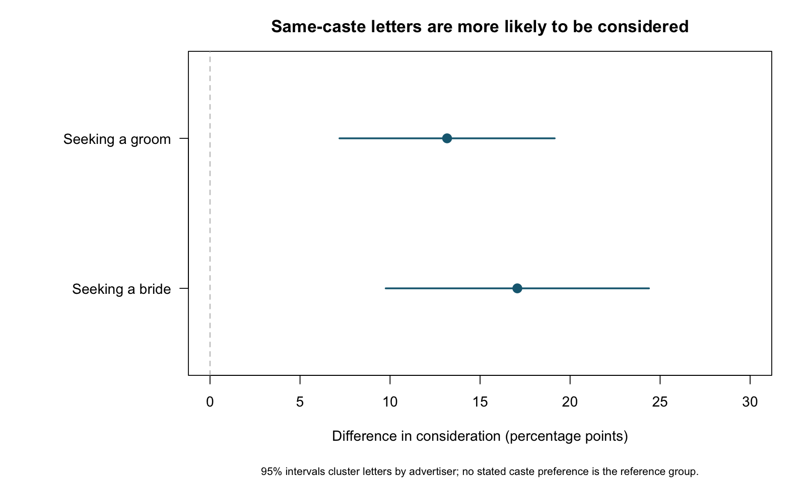

# For Better or Caste

An R reproduction and review of Banerjee, Duflo, Ghatak, and Lafortune's
[*Marry for What? Caste and Mate Selection in Modern India*](https://doi.org/10.1257/mic.5.2.33)
(AEJ: Microeconomics, 2013).

**About 69% of observed marriages are same-caste;
31% cross caste boundaries.** Among the
284 couples with caste recorded for both partners, 197
are same-caste and 87 are inter-caste.
Randomly re-pairing these same husbands and wives gives an expected **19.8% same-caste rate**.
Using all advertisers with usable caste reports instead gives **16.2%**.
Neither benchmark uses West Bengal's population caste shares: each conditions on a selected pool.
Inter-caste marriage is a substantial part of this sample, alongside strong caste sorting relative to these pools.
These are marriages or engagements observed at follow-up in a selected Bengali newspaper marriage market.

Random matching ignores every preference. The paper's caste-agnostic simulation retains estimated
preferences for education, age, income, and other attributes but removes the caste terms; it predicts
about **20% same-caste matching** (Table 7), using a broader market of advertisers. These benchmarks
answer different questions and use different pools. None identifies a causal effect of caste prejudice.
[Benchmark calculation and limits](ms/review.md#observed-marriages-and-matching-benchmarks).

A [direct education-capacity calculation](ms/review.md#educational-matching-possible-within-caste)
also asks how many same-education couples the pool could support within caste, without using
shortlisting coefficients. It reports achievable matches and how many people remain unmatched; it is a
feasibility bound, not a prediction of what families choose. Reproduce with `make education-capacity`.

The central same-caste shortlisting association reproduces and survives several inference and weighting checks.
The larger claim that caste preferences impose little economic cost relies on a matching model whose
fit, code, and interpretation need separate scrutiny. [Read the review](ms/review.md).

The paper makes three linked claims (printed pp. 35–36): families strongly prefer their own caste;
that preference can cost little if economically similar partners are available within each caste;
and this low cost can help caste preferences persist as the economy grows. The first claim comes
from letter shortlisting, the second from a matching model, and the third extends the model’s
argument beyond the observed marriage decisions. The [article](sources/paper.pdf), [appendix](sources/appendix.pdf), and two earlier drafts are
tracked in Git. The [version comparison](ms/review.md#changes-across-paper-versions) separates
changed specifications from reporting errors.



The respondents are mostly Bengali upper-middle-class families advertising for spouses in
*Anandabazar Patrika* in 2002–03. Interviews usually involved the relative managing the search.
There are **783 advertisers**. The main regressions use **5,628 letters to 506 advertisers seeking
a groom** and **3,944 letters to 277 advertisers seeking a bride**. These are decisions about
which letters to pursue, not observations of a spouse knowingly accepting a monetary loss.

| Question | Finding |
|---|---|
| Do the displayed caste coefficients reproduce? | All 28 checked coefficients match to printed precision; 27 of 28 SEs do, with the remaining discrepancy below 0.0001. |
| Does advertiser clustering eliminate the same-caste association? | No: about 13.2 percentage points for groom searches and 17.1 for bride searches. |
| Is a few advertisers' influence driving it? | The association survives all 506 and 277 advertiser deletions. |
| What does the headline income trade-off mean? | The simplified groom-income model's same-caste term implies a 49.4% outside-caste premium, with a bootstrap interval of 24.6–82.1%. Specific caste comparisons differ. |
| Does that establish WTP to avoid lower castes? | No. The full comparison also includes the prospective groom's caste, relative rank, and the advertiser's stated preferences. [Computed comparisons](output/lower_caste_income_contrasts.csv). |
| Does the matching model establish negligible costs? | The published uncertainty intervals allow substantial costs, and baseline simulated endogamy is 93% versus 69% in observed marriages. |
| Does the supplied simulation use the headline regressions? | Its coefficient bootstrap omits the weights used for the main tables. |
| Are there concrete code problems? | The male preference calculation miscoded same residence for 1,678,947 candidate pairs; the quality index drops education terms through an operator-precedence error. An independent review also confirms caste-rank and missing-attribute feature errors. 250 paired full-market draws quantify the joint preference-feature repairs, alongside ten earlier selected allocations. The corrections leave substantial predicted endogamy. [Simulation audit](ms/simulation-audit.md). |

**How much income does keeping caste cost in the matching model?** Under missing at random, the corrected,
weighted point-estimate model implies about **₹103 per month (0.4%)**
foregone among women initially assigned a same-caste husband. This is much smaller than the shortlisting trade-off,
consistent with strong preferences but small average income concessions in the model. The analysis uses 500 income
imputations of income in rupees, with log-income prediction as a sensitivity check. It does not identify actual household profit, and its imputation
ranges do not include preference or matching-model uncertainty. [Income-sacrifice analysis](ms/simulation-costs.md).

The general 49% income premium corresponds to accepting about 33% less income for the same-caste
option, not losing 49%. This is a regression conversion for the reference group, not a universal
price of caste. For a Brahmin family with no stated caste preference, the full model gives a
Baidya-groom premium of about 6% (95% bootstrap interval −22% to 50%) and a Kayastha-groom
premium of about 63% (31% to 108%). Both are lower-ranked in the authors' coding. Negative interval
endpoints mean the data also allow the alternative to be preferred without an income premium.

Run locally:

```sh
make deps
make run
make test
make lint
```

R 4.6.0 was used. `make run` rebuilds the six main linear regressions, two conditional logit fits,
the simplified groom-income specification, robustness checks, complete-procedure income
bootstraps, code diagnostics, and this README. The original files remain unchanged.

**Coverage:** This is a reproduction of the main preference evidence and an audit of the structural
claims, not a complete rerun of every published table. The R coding sensitivity covers 250 supplied coefficient draws under two feature definitions. Native Matlab equivalence,
Bayesian Figure 1, and all auxiliary appendix regressions remain unverified. The simplified bride-income point estimates now reproduce, but some income predictions
depend on restrictions the earnings data cannot identify; this specification is not used for reported WTP. See [coverage and limitations](ms/review.md).

**Remaining work:** propagate weighted preference uncertainty through matching and the income
counterfactual, after specifying how to handle terms unidentified in some resamples; resolve the
remaining interview identities and check native Matlab scoring, reporting variants, and search
frictions. Bayesian Figure 1 and auxiliary appendix regressions also remain unverified. Actual
household financial losses and a causal separation of caste taste from correlated compatibility
require additional evidence; more simulations alone cannot identify them.

The original [114406 replication archive](https://www.openicpsr.org/openicpsr/project/114406/version/V1/view)
contains two reverse-search datasets larger than GitHub's individual-file limit. They remain in the
local extraction but are excluded from Git; the implemented pipeline does not require them.
Original code and data carry the archive's [license](data/original/LICENSE.txt).
Source URLs, version dates, and file hashes are recorded in [the paper manifest](sources/paper_versions.csv).

[Research and writing opportunities arising from the review](ms/research-opportunities.md).

The [tradeoff interpretation](ms/tradeoff-interpretation.md) translates the preference estimates into income and education comparisons and examines family resources and cultural explanations.

The full paired coding comparison, selected income counterfactuals, and their limits are documented in the [simulation audit](ms/simulation-audit.md). The [independent feature review](ms/simulation-feature-review.md) traces the confirmed handoff errors to the original programs. `make simulation`, `make simulation-weighting`, and the additional targets documented in that audit reproduce the separate simulation comparisons; `make test` runs the local validation suite.

The [groom-income support check](ms/groom-income-support.md) finds no corresponding normalization problem in the model behind the 49% premium. The [bride-income audit](ms/bride-income-audit.md) resolves the numerical discrepancy and demonstrates the unsupported income extrapolations. The [conditional matching-cost audit](ms/simulation-costs.md) reconstructs the cost regressions on all 500 original/corrected allocations and earlier selected comparisons and reports sparse or unidentified comparisons. [Independent agy audit and adjudication](ms/independent-audit.md).

For the full paired sensitivity across the first 250 supplied coefficient draws, run `Rscript src/simulation_batch.R --workers=2 --draws=1:250 --scenarios=original,feature_corrected`. The runner saves a separate checkpoint for every validated allocation under `output/simulation_runs/`, resumes matching checkpoints, and stops if its input or source hashes change. This uses the original unweighted coefficient draws. Its manifest and status files distinguish completed work from a partial run; it does not reproduce a weighted coefficient bootstrap or certify native Matlab equivalence.

Use `make simulation-batch-costs RUN_DIRECTORY=output/simulation_runs/<run_hash>` to summarize completed allocations. Outputs go to that run’s `table8/` directory and report completed, requested, and identified draw counts separately. Partial summaries are provisional; percentiles of identified coefficients do not reproduce the published Table 8 confidence intervals when some requested comparisons cannot be estimated.

`make simulation-batch-summary RUN_DIRECTORY=output/simulation_runs/<run_hash>` exports paired sorting changes,
common-sample comparisons, and draw percentiles. `make simulation-income` computes the same-woman income comparisons
on the selected saved allocations, applies 500 MAR imputations in two specifications, and audits 250 fresh weighted coefficient resamples; it does not generate 250 weighted matching allocations.

`make paper-versions` checks the published fit claims against the displayed tables in the 2009,
November 2010, and final versions. It requires Poppler (`pdftotext`) and uses the final-table
transcription generated by `src/structural_checks.R`. This checks paper tables, not historical code execution.
